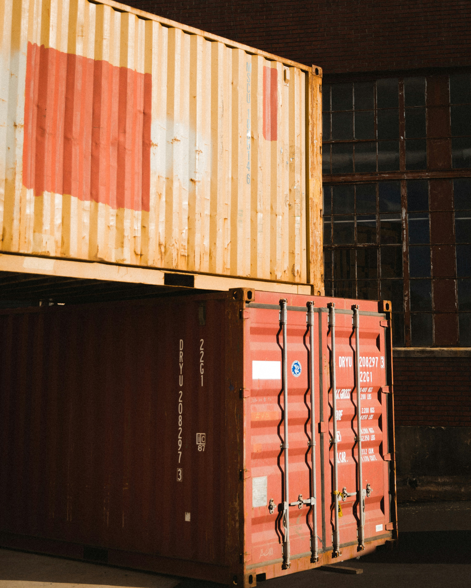
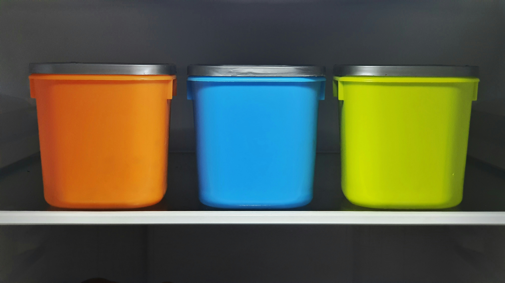
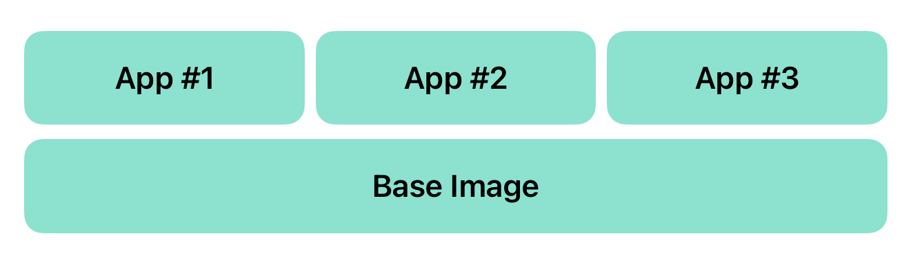
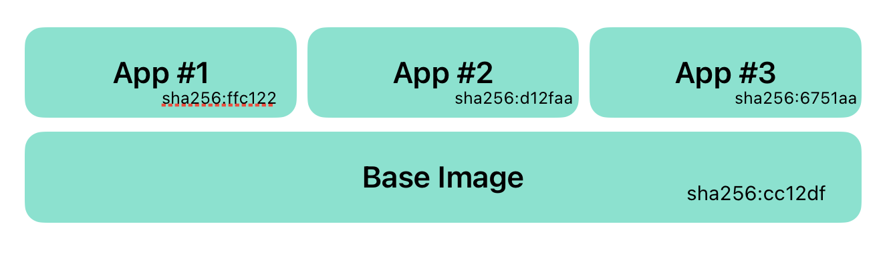

<!-- 
_class: titlepage
_footer: Photo by <a href="https://unsplash.com/@nosaka?utm_content=creditCopyText&utm_medium=referral&utm_source=unsplash">nikko osaka</a> on <a href="https://unsplash.com/photos/brown-and-red-shipping-containers-WzZjyThDoR8?utm_content=creditCopyText&utm_medium=referral&utm_source=unsplash">Unsplash</a>
_paginate: false
-->

# Everything You Wanted to Know About Containers but were Afraid to Ask

---

## Daniel Mikusa
- Lead Software Engineer @ 7SIGNAL, Inc
- Paketo Steering Committee Member
- Cloud-Native Buildpacks Maintainer

### Contact Me
- <small>dan@mikusa.com</small>
- <small>https://github.com/dmikusa</small>
- <small>https://www.mikusa.com</small>

---

# Slides

---

# Why are we here today?

<!-- 
Poll:
- Who's using containers?
- Who's doing the bare minimum to get containers into prod?
- Who's a container expert?

It's common. Many devs use containers, but don't really understand them. It's easy enough to copy & paste to get the job done. Especially when you're busy writing code. Today's a chance to fix that.
-->

---

# Learn & Understand Containers

<!-- 
You can get by with the minimum amount of container flair, but there are benefits to understanding the technology better.

- You can create better images that take advantage of the technology. Yes there are better images. Images that are more compact, that change less, that load faster.
- You can evaluate container technology easier and faster
- You can design systems that work better and take advantage of the technology. For example, with AWS lambdas. You can ship a zip archive or a container image. Container images can load faster if you take advantage of the technology.
- You can use the technology in new and interesting ways.
-->

---

# Also, because ...

<!--
If for no other reason, they're everywhere. It helps to understand the technology.
-->

---

<!--
_footer: 'Photo by <a href="https://unsplash.com/@syhussaini?utm_content=creditCopyText&utm_medium=referral&utm_source=unsplash">Syed Hussaini</a> on <a href="https://unsplash.com/photos/orange-blue-and-green-plastic-containers-F2JwUVuRz2I?utm_content=creditCopyText&utm_medium=referral&utm_source=unsplash">Unsplash</a>'
-->

# What is a container?

<!--
It's complicated, but at a high level, a "container" refers to an isolated process on a Linux system. 

It's a little easier to describe what it's *not*.
-->

---

# What's **NOT** a container?

<!--
It's not Docker. It's not a Dockerfile. This is a very common misconception and incorrect use of terminology. Docker is a popular tool to use containers, it will let you create containers, but it is not a container. It's a little bit like calling a car, a Ford (or some other brand).
-->

---

# What's **NOT** a container?

<!--
It's not a VM. Containers are similar to VMs and it's a natural way to think about what a container is doing for you, because they both provide isolation. There are differences though. VMs offer a higher level of isolation, isolating an entire system, while containers share a kernel because they isolate at the process level. We'll talk more about the differences on an upcoming slide.
-->

---

# So What is a container then?

## It's an isolated process.

### Using

- Linux Kernel CGroups
- Linux Kernel Namespaces
- App Armor / capabilities restrictions
- Union FS or Overlay FS
- Base Image
- Configuration

---

# Container Strengths & Weaknesses

## Strengths

- Cheap/Fast
- Easy way to package code
- Ubiquitous & battle tested
- Strong tooling & libraries
- Standardized (OCI)
- Efficient distribution protocol

## Weaknesses

- Weaker isolation
- Container security config [*](https://security.stackexchange.com/a/153016)
- CPU shares are challenging
- Noisy neighbors

<!-- 
The key signs containers are a good fit:
- You need something that starts up really fast/has low overhead.
- You need to distribute your app and ensure it runs consistently everywhere.
- Process level isolation is good enough, which is usually the case.
- Where the app runs can run containers easily.

The classic example where it's a good fit is when deploying services & web apps.

Common examples that are not good fits: desktop apps, cli apps, and services that required more isolation (AWS Lambdas is an example) or more guarantees around hardware resource availability (very latency specific, almost real-time requirements, access to specific hardware like GPU).

Security is good, but different from VMs. VMs start with high isolation which gives them a more secure by default position. Containers are just isolated processes, but you have to layer on that isolation and you have to take away capabilities. If this isn't done right, if you don't configure things correctly, there can be problems.
-->

---

# What else do we need?

<!--
Images! We need an image.
-->

---

# What's an image?

<!--
An image is a collection of files plus some configuration.
-->

---

# Layers

<!--
You can download VMs, but it's just one big file. If you change something in the VM and save it, you now have a totally different file. This makes it hard to use VM images to do things like ship your application.

An image is made up of one or more layers, each with it's own unique set of files. Layers are applied in order, with layers on top shadowing or masking files in the layers below them.
-->

---

# Sharing Layers

<!--
The base image, like Ubuntu or UBI, can be the same and you can add different layers on top of that.

When users pull your images, the base image only gets downloaded once but it can be paired with the layer for each app to run those apps.
-->

---

# Image Hashes

sha256:32acffd

<!--
Every layer has a hash. The hash guarantees the contents of the layer, so you know what's in it and that it can't be changed or tampered with.

It also allows deduplication of layers, which is how different images can share layers. The tooling can uniquely identify a layer independent of the image and know exact what's in that layer.

The configuration for the image also has a hash and so does the image as a whole. This provides the same change guarnatees for configuration & the image as a whole.
-->

---

# Demo: Deconstructing a Container Image

---

# Image Distribution

<!--
Images are distributed through container registries. You can "push" a container image to a registry and "pull" images from a container registry.

There are public container registries like Docker Hub, GHCR, or Quay.io. The cloud providers all have their own registries, and you can also run your own registry too.

A "registry" is just an HTTP service. There's a defined API that's part of the OCI distribution specification. While you typically hear about "push" and "pull" operations, there is no single API call to do that. Those high-level operations are made up of multiple API calls. This allows the client to efficiently interact with the registry.

[https://github.com/opencontainers/distribution-spec]
-->

---

# Demo: Fetching Images

---

# Running Containers

<!--
There are many ways to run a container. That's part of the beauty of containers. They are a standard, so you have all sorts of different software that can take your container images and run them.

Running locally, you can use Docker or Podman. Running as a service, you have Kubernetes, Cloud Providers (AWS ECS), and all sorts of PaaS & IaaS technologies.

What is actually happening here when your container is run though?
-->

---

# What's Really Required to Run a Container

<!--
The Linux kernel is the core requirement to run a container image. Even on other operating systems like Windows or MacOS, it's using Linux in a VM (Windows technically has some native support, but it's rare to see).
-->

---

# Linux Kernel Primitives

- CGroups
- Namespaces
- Capabilities
- Seccomp
- AppArmor

<!--
The Linux kernel provides the primitives to isolate a process inside a container. It gives us Cgroups, which are a way to put limits on the process around things like memory & CPU usage. Then it gives us namespaces, which are a variety of different facets (network, process ids, mounts, IPC, user, and unix time sharing) on a process that you can isolate.

The cool thing about namespaces is that you don't necessarily have to use all of them. Most container runtimes do, because they want more isolation, but you can do things like have a shared network between containers (K8s pods) or have a shared filesystem or process space between containers).

The also kernel gives us the ability to drop certain capabilities, such as `CAP_SYS_ADMIN`, which limit what the container can do and thus increase the security posture of the container. In addition to dropping capabilities, many tools will also use `seccomp`, which can be used to filter what syscalls are allowed by the process.

Lastly, AppArmor allows further allow/block-listing of what the process can do. In this case, it can restrict access to the files or network at a fine grained level.

In a nutshell, these all allow a container (i.e. isolated process) to be sandboxed.

[https://security.stackexchange.com/questions/196881/docker-when-to-use-apparmor-vs-seccomp-vs-cap-drop]
-->

---

# A Filesystem

<!--
This comes in the form of a container image. The container image, as previously mentioned, has multiple layers which are all extracted and then made available using a union or overlay filesystem.

> It combines multiple different underlying mount points into one, resulting in a single directory structure that contains underlying files and sub-directories from all sources.

[https://en.wikipedia.org/wiki/OverlayFS]

In this case, it combines all of the layers into a filesystem for your container.
-->

---

# Configuration / Settings

<!--
The last thing you will need is configuration. The command to run, working directory, maybe some environment variables, possibly labels, a health check to run, and maybe other volumes to mount into the container.

These are all things that can change the way the container operates, but don't require rebuilding the container image.
-->

---

# Run Docker Run

- `docker run`
- `podman run`
- `kubectl apply`
- AWS ECS, Lambda (or other Cloud Provider)

<!--
The easy way to run a container is with Docker, Podman, Kubernetes, or tools from one of the many Cloud Provider.

These tools handle all of the heavy lifting. Fetching images, storing images, creating file systems, creating the container securely, allowing you to configure them and providing you with all the tools to manage your containers & images.
-->

---

# The Hard Way

<!--
These tools are just using Linux Kernel APIs, so one can write code and build their own containers. In most cases, you'd want to use existing tooling (faster/easier/more secure), but it's good to remember that you can do this stuff too! It's achievable and there may come a day when you can take advantage of this in your projects! 

To experiment, the Linux Kernel also provides some tooling that you can use to manipulate these APIs. For example, `unshare` allows you to start processes running with different namespaces. There's also libcgroup, which provides tooling for interacting with Cgroups.
-->

---

# Demo: namespaces & cgroups

---

# Questions?

:thinking:

