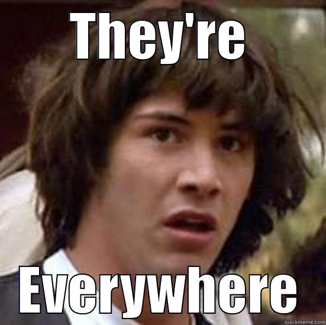
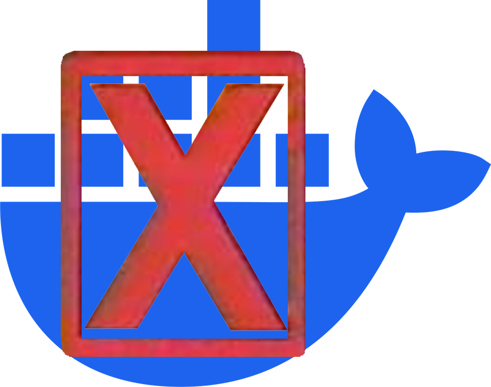

<!-- 
_class: titlepage
_footer: Photo by <a href="https://unsplash.com/@nosaka?utm_content=creditCopyText&utm_medium=referral&utm_source=unsplash">nikko osaka</a> on <a href="https://unsplash.com/photos/brown-and-red-shipping-containers-WzZjyThDoR8?utm_content=creditCopyText&utm_medium=referral&utm_source=unsplash">Unsplash</a>
-->

# Everything You Wanted to Know About Containers but were Afraid to Ask

---

## Daniel Mikusa [<small>dan@mikusa.com</small>]
- Lead Software Engineer @ 7SIGNAL, Inc
- Paketo Steering Committee Member
- Cloud-Native Buildpacks Maintainer

---

# Why are we here today?

<!-- 
kdjfkdj adsfadsf asdfasdf
-->

---

# Containers

---

<!--
_footer: 'Photo by <a href="https://unsplash.com/@syhussaini?utm_content=creditCopyText&utm_medium=referral&utm_source=unsplash">Syed Hussaini</a> on <a href="https://unsplash.com/photos/orange-blue-and-green-plastic-containers-F2JwUVuRz2I?utm_content=creditCopyText&utm_medium=referral&utm_source=unsplash">Unsplash</a>'
-->

# What is a container?

---

# What's **NOT** a container?

---

# What's **NOT** a container?

---

# So What is a container then?

- Linux Kernel CGroups
- Linux Kernel Namespaces
- App Armor / capabilities restrictions
- Union FS or Overlay FS
- Base Image
- Configuration

---

